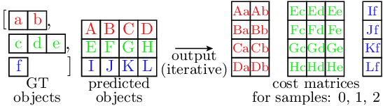
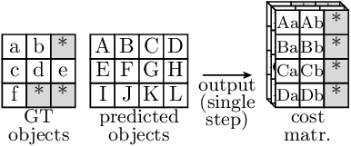
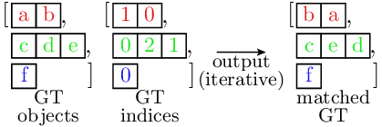
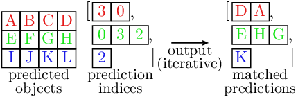
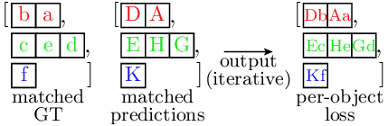
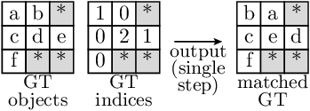
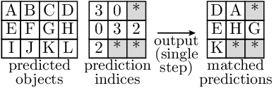
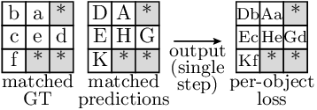

Example
========

Here, we provide an example of how to use the `batching-helpers` package to implement object detection loss, 
including

- Handling of per-sample (i.e. non-batched) input data
- Matching between predictions and ground truth (GT) objects as a pre-requisite for the actual loss 
  computation
- Loss computation of different types:

  - Based on direct object-to-object comparisons (in this example: classification and bounding box regression 
    losses)
  - Computed for all predictions, but utilizing the matching results (in this example: existence loss)

The implementation of the loss computation is fully shown in the code snippets in this document.
The complete implementation (including helpers providing example input data to actually run the code) can be 
found in the `example` folder of the `batching-helpers` package.

.. important::

   You can run the example using the script ``packages/batching_helpers/example/example.py``.

Overview
--------

The loss computation implementation consists of three main steps:

1. Conversion of ground truth per-sample data into :class:`~accvlab.batching_helpers.RaggedBatch` instances
2. Matching predictions to ground truth objects
3. Loss computation

The following code snippet demonstrates this high-level approach. Step (1) is fully covered here, while 
steps (2) and (3) are detailed in subsequent sections.

.. note-literalinclude:: ../example/example.py
   :language: python
   :caption: packages/batching_helpers/example/example.py
   :linenos:
   :lineno-match:

Matcher
-------

Efficient Implementation Approach
~~~~~~~~~~~~~~~~~~~~~~~~~~~~~~~~~

The matcher implementation is designed to be efficient on the GPU. The matching consists of two steps, namely 
the cost matrix computation and the Hungarian matching based on the costs.
As the matching itself is on the CPU (and remains non-batched), performance gains are mainly achieved through 
the batched cost matrix computation. 

The cost matrices are structured as follows: For each sample, the cost matrix denotes the cost of each 
possible match between a prediction and a GT object. For example, for a match of prediction `i` and a GT 
object `j`, the cost is `cost_matrix[i, j]`. This means that for each sample, the cost matrix is of size 
``(num_predictions, num_gt_objects)``, and each element is computed from one prediction and one GT object.

Non-batched Approach
^^^^^^^^^^^^^^^^^^^^

The following figure shows typical non-batched cost matrix computation:

In the illustration, the different colors represent the individual samples, and each sample corresponds to one 
computation iteration. Note that:
  
  - The GT data is of variable size (and therefore stored as a list of per-sample tensors, not a single tensor)
  - Due to the variable GT size, the sizes of the cost matrices are also variable in the dimension iterating 
    over the GT objects (`dim==1`; horizontal axis in the figure)

Due to this variable size, batched implementation is challenging and in practice, the cost matrix computation 
is often implemented in a non-batched manner.

Batched Approach
^^^^^^^^^^^^^^^^

The following figure illustrates how the matching can be implemented in a batched manner using the 
`batching-helpers` package:

Gray elements represent filler values that allow uniform batch processing while preserving variable ground 
truth sizes. The :class:`~accvlab.batching_helpers.RaggedBatch` class as well as the available helper functions 
handle these values automatically. Please refer to the :doc:`API documentation <api>` for details.

The key implementation principles to achieve batched processing are:

- Ground truth data for all samples is stored in a single :class:`~accvlab.batching_helpers.RaggedBatch` 
  instance for batched processing with variable sizes (as shown in the figure)
- Cost matrices also use :class:`~accvlab.batching_helpers.RaggedBatch` format with the non-uniform dimension 
  being the dimension iterating over the ground truth elements (as shown in the figure)
- Handling of the non-uniform size:

  - During the cost matrix computation, uniform sample sizes are assumed (i.e. no differentiation between data 
    and filler values), enabling the use of standard PyTorch operations or e.g. already implemented custom 
    implementations of batched cost functions
  - After the computation, the results are wrapped in a :class:`~accvlab.batching_helpers.RaggedBatch` 
    instance, which enables easy handling of the filler values. Here, the samples sizes of the input GT data 
    can be re-used, so that they do not need to be set up manually.

Note that this approach means that computations are also performed for the filler values, which leads to some 
overhead. However, this overhead is typically much smaller than the gains of the batched implementation, which 
reduces the CPU (Python) overhead and improves the GPU utilization for the individual operations.

Implementation
~~~~~~~~~~~~~~

The matcher implementation is shown in the following snippet, with the core functionality residing in the 
`__call__()` method. The matcher employs various cost functions. These cost functions do not explicitly handle 
non-uniform batches, instead assuming a fixed size for the individual samples. As discussed above, this means 
that existing batched implementations of such cost functions can be readily re-used.

The handling of non-uniform batches in the resulting cost matrices is achieved by wrapping the results as 
:class:`~accvlab.batching_helpers.RaggedBatch` instances, where the number of valid GT objects is known from 
the input GT data (see the comments in `__call__()` for implementation specifics).

Note: The core matching operation (:func:`scipy.optimize.linear_sum_assignment()`) is performed on the CPU and 
remains non-batched. The `batching-helpers` package facilitates integration of non-batched operations through 
:meth:`~accvlab.batching_helpers.RaggedBatch.split` and :func:`~accvlab.batching_helpers.combine_data` 
functions.

.. note-literalinclude:: ../example/matcher.py
   :language: python
   :caption: packages/batching_helpers/example/matcher.py
   :linenos:
   :lineno-match:

Loss Computation
----------------

Efficient Implementation Approach
~~~~~~~~~~~~~~~~~~~~~~~~~~~~~~~~~~

Similar to the matcher, the efficiency is improved by enabling batching where it was previously challenging to 
achieve. 
For most loss types, the loss is computed by an element-wise (i.e. object for object) comparison between the 
predictions and the GT objects.
Here, the corresponding (according to the matching) GT and prediction objects need to be extracted first, 
followed by the actual loss computation.

Note that the existence loss is computed differently, as it is not based on a direct object-to-object 
comparison.
The existence loss is not discussed here, but it also benefits from batched implementation in a similar way.
It is part of the example implementation, so please refer to the code snipped further below for details.

Non-batched Approach
^^^^^^^^^^^^^^^^^^^^

The loss computation is comprised of two steps. First, the corresponding objects for the predictions and the 
GT are extracted.

Ground truth object extraction at matched indices:

Note that here, both the GT objects and the indices are lists of tensors. Similar to the matcher,
different samples are indicated by different colors, and are typically processed sequentially, one sample at a 
time.

Similarly, the predictions at the matched indices are extracted as follows:

This step is very similar to the GT object processing shown above. A notable difference is that the 
predictions are stored as a single tensor, as the predictions are outputs of the trained model and their 
number is typically fixed.
However, as the number of matches varies between samples, the indices are stored as a list of tensors, 
preventing the use of a single tensor in the output.

Finally, the loss is computed by comparing the predictions and the GT objects.

Batched Approach
^^^^^^^^^^^^^^^^

Similarly to the matcher, the loss computation is done in a batched manner by using the 
:class:`~accvlab.batching_helpers.RaggedBatch` format.

The extraction of the GT objects is done as follows:

Similarly, the predictions are extracted as follows:

Finally, the loss is computed by comparing the predictions and the GT objects.

Note that all operations are performed in a batched manner. For the indexing operation, the function 
:func:`~accvlab.batching_helpers.batched_indexing_access` is used.
Similar to the matcher, we also process filler values in the loss function(s), which leads to some overhead. 
However, this is typically far outweighed by the performance gains of the batched implementation.

Here, we discussed the loss implementation as is e.g. used in the classification and bounding box regression 
losses in the implementation above. Note that e.g. the existence loss follows a different approach.
However, the same principles apply.

Implementation
~~~~~~~~~~~~~~

The loss function takes two key inputs:

1. Ground truth objects and predictions (same as matcher)
2. Matching results mapping predictions to corresponding ground truth objects

Loss functions operate on batched data assuming uniform sample sizes (similar to the cost functions employed 
by the matcher), allowing direct reuse of existing batched implementations. See the `__call__()` method 
comments for implementation details.

.. note-literalinclude:: ../example/loss_computation.py
   :language: python
   :caption: packages/batching_helpers/example/loss_computation.py
   :linenos:
   :lineno-match:

