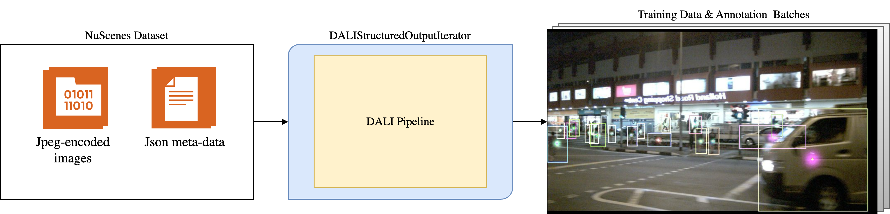

Introduction
============

This page provides an overview of the design of the :doc:`DALI <nvidia.dali:index>` pipeline framework for  
the ADAS domain provided by this package.

Why DALI
--------

The NVIDIA Data Loading Library (DALI; see :doc:`DALI documentation <nvidia.dali:index>`) can be used to 
implement efficient GPU-accelerated data loading & pre-processing pipelines, aimed at use in Deep Learning 
training scenarios. 

On the one hand, it provides a set of efficient 
operators (such as e.g. image decoding, affine & color transformations, etc.), where most of them can be run
both on the CPU and the GPU. On the other hand, DALI is based on pipelines, which allow efficient utilization 
of both the CPU and the GPU, while avoiding the need to transfer of data between processes when passing the 
pipeline output to the training implementation (which would typically 
entail GPU to CPU transfers if any data is on the GPU). This is achieved by a design where the Python 
pipeline implementation is 
not executed directly, but instead, is used to construct a DALI graph, which then is executed in parallel to 
the training implementation using native threading. The individual operators can choose to utilize additional
worker threads for the processing of the data or run in a single thread. This allows efficient
multi-threading for the CPU operators, while allowing GPU operators to operate on whole batches of data 
(using a single CPU thread to orchestrate the GPU workload for the whole batch), 
improving the achieved utilization of the GPU. 

The complexity of the data batching and threading is transparent to the user.
While the pipeline processes batches of data, the Python pipeline definition can be written in a way as 
if a single sample is processed, simplifying the implementation. When branching is needed, DALI will 
automatically take care of grouping the samples for each of the branches, so that the individual operators
still operate on a (reduced) batch of samples for each of the branches.

Why the ADAS DALI Pipeline Framework
------------------------------------

While DALI enables the creation of efficient pipelines, implementing pipelines directly with DALI for complex
training sample data formats, as are typically needed in the ADAS domain, is challenging. Individual samples
typically represent a whole scene. Such a scene may e.g. contain 3D annotations, as well as data from 
multiple points in time, where for each time point, there may be ego-pose related information, as well as 
images from multiple cameras, each with its own projection geometry and set of 2D annotations. 

This data format setup is challenging to manage in DALI, which does not support nested data formats 
out-of-the-box. Additionally, some non-standard or unsupported operations (e.g. string processing) may be 
challenging to implement in DALI.

PyTorch DALI Proxy
~~~~~~~~~~~~~~~~~~

To mitigate this, DALI provides a PyTorch DALI proxy, which allows to perform most of the processing in
the PyTorch data loader, while still using DALI for the most computationally intensive parts, leveraging the 
best of the two worlds. In this way, it is possible to use efficient DALI-based processing for computationally 
intensive parts, while keeping cheap, but often non-standard, processing steps in the PyTorch data loader. The 
hierarchical data format supported by the PyTorch data loader can also be preserved. While the DALI 
pipeline(s) still operate on a flat format, it can be inserted into the hierarchical data format supported by
the PyTorch data loader.

Our Approach
~~~~~~~~~~~~

In this package, we use a complimentary approach to simplify DALI pipeline implementation: We create a DALI 
pipeline framework, which is designed specifically for the needs of the ADAS domain, and which is designed to 
be modular and flexible, and enable easy definition of pipelines from scratch, using the pre-implemented
processing steps.

While the PyTorch DALI proxy is a good match for fixed and/or already existing PyTorch DataLoader 
implementations, it is challenging to use with modular pipelines, where individual pre-implemented processing 
steps can be combined into a pipeline (as the results of the DALI processing are not available inside the 
PyTorch data loader). Therefore, we implement the whole processing pipeline in DALI. Apart from that, we make 
extended use of the DALI graph construction step to implement
flexible processing steps which are highly adaptable to the input data without incurring a runtime cost once
the graph is constructed.

We provide a helper data container (:class:`~accvlab.dali_pipeline_framework.pipeline.SampleDataGroup`) to 
manage nested data formats in DALI. We also provide a selection of pre-implemented processing steps, which 
operate on the data in this format. The package furthermore contains other components needed to build a DALI 
pipeline and provide the output data in a structured format.

This approach enables us to:

- Make the processing steps highly flexible and adaptive to the input data. Making use of the DALI graph 
  construction step, we can implement processing steps which e.g. dynamically search the input data for 
  relevant entries (e.g. all images, or all data from a single camera), and process it accordingly. This 
  avoids the need to enforce a fixed data format in each processing step. At the same time, this automation 
  only incurs a one-time cost at pipeline construction time, not during the pipeline execution.
- Utilizing the :class:`~accvlab.dali_pipeline_framework.pipeline.SampleDataGroup` class in combination with 
  the :class:`~accvlab.dali_pipeline_framework.pipeline.DALIStructuredOutputIterator` wrapper for the pipeline, 
  we can provide a structured output in the exact same format that a typical PyTorch DataLoader would provide 
  (i.e. a nested dictionary), so that the DALI pipeline can be used as a drop-in replacement, without the need 
  to change the training implementation (except for the construction of the pipeline instead of a PyTorch 
  DataLoader). Note that while this may be possible with the PyTorch DALI proxy, it is not supported
  out-of-the-box for pure DALI pipelines.
- Enforce a well-defined data format (as a :class:`~accvlab.dali_pipeline_framework.pipeline.SampleDataGroup` 
  blueprint instance, containing the format, but not the actual data) & check the processing steps for 
  compatibility with each other & the input data.

Overview
--------

The ``dali_pipeline_framework`` package provides a flexible pipeline framework on top of DALI. It is designed 
to simplify the creation of pipelines for typical use-cases in the AUTO domain, as well as to enable 
integration into existing training implementations with as few changes as possible. Ideally, the only changes 
needed are related to the creation of the pipeline, while the rest of the training implementation remains 
unchanged. Please also see the :doc:`examples`.

The pipeline framework is used to provide input data to the training. This task can be further broken down 
into the following steps:

  - Loading of data (typically from files)
  - Processing the data, including augmentations, but also e.g. decoding of images, etc.
  - Potentially post-processing the data (e.g. converting to a format not directly supported by DALI), 
    and outputting it to the training implementation

   Example pipeline for loading & pre-processing the NuScenes dataset for 2D object detection.

In the following pages, the :class:`~accvlab.dali_pipeline_framework.pipeline.SampleDataGroup` data format is 
discussed first, followed by a discussion of the pipeline processing steps. Then, we discuss how to obtain the 
input data for the pipeline. Finally, we discuss how to output the data from the pipeline to the training 
implementation, allowing the pipeline to be used as a drop-in replacement for a PyTorch DataLoader. 

.. toctree::
   :maxdepth: 1

   design/sample_data_group
   design/pipeline_processing_steps
   design/input
   design/output

.. seealso::

   Reading & inputting the data to the pipeline is data-set & use-case specific, and therefore needs to be 
   implemented by the user of the package (see :doc:`design/input`). We discuss the suggested approach as well 
   as an example implementation for the NuScenes dataset in more detail in 
   :doc:`examples/use_case_specific/nuscenes_data_loader`.