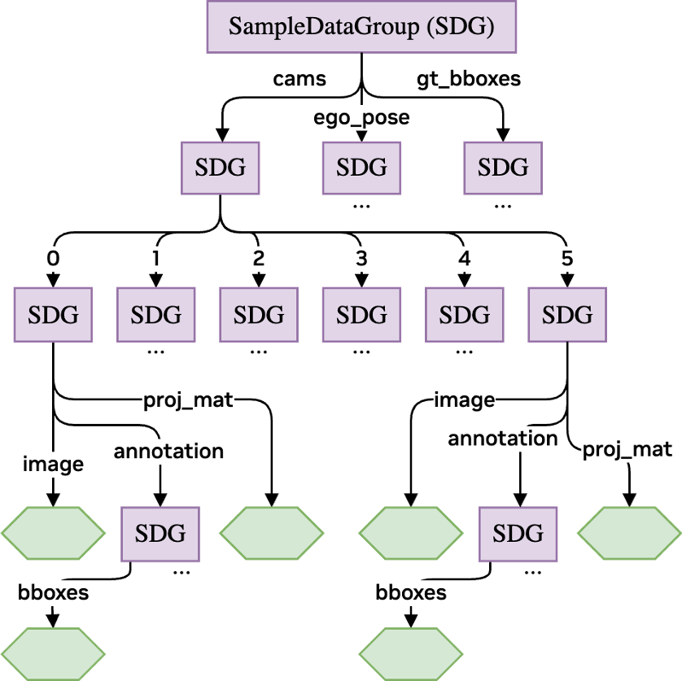

Data Format: Sample Data Group
==============================

Motivation & Overview
---------------------

Throughout the pipeline, an internal data format, :class:`~accvlab.dali_pipeline_framework.pipeline.SampleDataGroup`, 
is used to organize the training data. In the AUTO use-case, the training samples are often most naturally 
described using a hierarchy. For example: 

.. code-block:: text

    The training sample contains 6 cameras, where the data for each camera includes an image, 
    a projection matrix, as well as image annotations, where the image annotations 
    are composed of object bounding boxes... Apart from the camera data, there is also an ego-pose of the 
    vehicle, as well as annotations containing (3D) bounding boxes...

A common choice is nested dictionaries, which fit the hierarchy well. Our
:class:`~accvlab.dali_pipeline_framework.pipeline.SampleDataGroup` plays a similar role but adds strict format handling
and utilities that support DALI pipeline construction. Its design serves the following goals:

  - **Well-defined data format**: Each instance has a predefined format (what data exists, how it is
    organized, and what are the data types). The format can be changed, but only explicitly.
    Instances can also be "blueprints" (format only) used to infer a step’s output format from its input,
    track available data, detect incompatible steps, and provide convenient conversion to/from the format 
    required by the underlying DALI pipeline at certain steps (data input & output). All these use-cases are 
    supported before actual pipeline execution, when no data is yet available (e.g. useful when creating 
    iterators, e.g. a :class:`~nvidia.dali.plugin.pytorch.DALIGenericIterator`, or a 
    :class:`~accvlab.dali_pipeline_framework.pipeline.DALIStructuredOutputIterator`).
  - **Flexible processing steps**: Steps are implemented so that, for example, an image decoding step can 
    automatically find and process all images without manually specifying their exact locations in the data. 
    This discovery happens during DALI graph construction, so there is no runtime cost during pipeline 
    execution. :class:`~accvlab.dali_pipeline_framework.pipeline.SampleDataGroup` provides reusable utilities (e.g., 
    :meth:`~accvlab.dali_pipeline_framework.pipeline.SampleDataGroup.find_all_occurrences`), which can be directly used 
    when implementing new flexible pipeline steps following that design.
  - **Support of structured data accross pipeline borders**: The data format can be used to pass hierarchical 
    data across pipeline borders, i.e. when inputting the data into the pipeline and when outputting the data 
    from the pipeline. Note that nested dictionaries cannot be easily used for this purpose, as the 
    inputs/outputs to/from the underlying DALI pipeline are expected to be flat tuples of individual data 
    fields. The :class:`~accvlab.dali_pipeline_framework.pipeline.SampleDataGroup` provides utilities to handle 
    conversions between the hierarchical and flat data formats in a way that is transparent to the user of the
    pipeline (see related methods, e.g.,
    :meth:`~accvlab.dali_pipeline_framework.pipeline.SampleDataGroup.get_data`, 
    :meth:`~accvlab.dali_pipeline_framework.pipeline.SampleDataGroup.set_data`,
    :meth:`~accvlab.dali_pipeline_framework.pipeline.SampleDataGroup.field_names_flat`, 
    :meth:`~accvlab.dali_pipeline_framework.pipeline.SampleDataGroup.field_types_flat`, 
    ...).

   Example of a data format definition as a :class:`~accvlab.dali_pipeline_framework.pipeline.SampleDataGroup`
   object.
   This example corresponds to the text example given at the beginning of this section. 
   Green hexagons represent fields containing actual data (so called data fields; see :ref:`field_types`). 
   Purple rectangles represent :class:`~accvlab.dali_pipeline_framework.pipeline.SampleDataGroup` objects (so 
   called data group fields; see :ref:`field_types`).

.. important::

  Please note that:
    - It is configurable whether type checking should be performed at assignment time. By default, it is 
      enabled.
    - To disable type checking, use 
      :meth:`~accvlab.dali_pipeline_framework.pipeline.SampleDataGroup.set_do_check_type`. 
    - For the pipeline, there is a corresponding option in the 
      :class:`~accvlab.dali_pipeline_framework.pipeline.PipelineDefinition` constructor, which controls 
      whether data format/type checking is enabled inside the DALI pipeline. By default, it is enabled.
    - Type checking is useful when developing the pipeline/processing step, but adds some overhead.
      Therefore, it is advisable to disable it in production.

.. _field_types:

Field Types
-----------

- **A** :class:`~accvlab.dali_pipeline_framework.pipeline.SampleDataGroup` **contains different types of fields**:

    - **Data fields**: Store actual data. Each field has a predefined type (changeable only explicitly).
      The fields may either be of the :class:`~nvidia.dali.pipeline.DataNode` type (inside the DALI pipeline),
      or of a type supported as input/output of the pipeline (e.g. :class:`numpy.ndarray`, 
      :class:`torch.Tensor`, etc.). For the special case of ``string`` data, see :ref:`special_case_strings`. 
    - **Data group fields**: Data group fields are intermediate hierarchy levels in the data format, and 
      themselves contain multiple fields. The data group fields are themselves 
      :class:`~accvlab.dali_pipeline_framework.pipeline.SampleDataGroup` objects.
    - **Array fields**: A special case of data group fields whose children have integer names covering a
      continuous range starting at 0. Any data group field meeting these conditions is treated as an array
      field (check with :meth:`~accvlab.dali_pipeline_framework.pipeline.SampleDataGroup.is_array`). An array field is
      regarded as a more specific subtype if additional conditions are fulfilled:

        - **Data field array**: All children are data fields (check with
          :meth:`~accvlab.dali_pipeline_framework.pipeline.SampleDataGroup.is_data_field_array`).
        - **Data group field array**: All children are data group fields (check with
          :meth:`~accvlab.dali_pipeline_framework.pipeline.SampleDataGroup.is_data_group_field_array`).

    - **Note**: Although array fields are just data group fields meeting these constraints, the distinction is 
      useful. :class:`~accvlab.dali_pipeline_framework.pipeline.SampleDataGroup` provides helpers to define data field 
      arrays and data group field arrays in a concise way. Also, checks if a field is an array field are 
      useful for validation and error checking.

.. _special_case_strings:

Special Case: Strings
----------------------

DALI does not directly support ``string`` data inside the pipeline. 

  - Typically, strings are used in two ways during pre-processing:

    1. As labels (e.g. class/category), which are converted to numeric values before training
    2. Passed through the pre-processing and used later as strings (e.g. sequence identifiers)

  - **The** :class:`~accvlab.dali_pipeline_framework.pipeline.SampleDataGroup` **supports both use-cases by 
    (respectively)**:
  
    1. User-defined mappings that automatically convert strings to numbers on assignment for selected 
       fields. The mapping is defined in 
       :meth:`~accvlab.dali_pipeline_framework.pipeline.SampleDataGroup.add_data_field` (with the type set to 
       the type after mapping is applied).

    2. Transparently auto-converting strings to an internal format (``uint8`` sequences) for transport 
       through the pipeline, and converting back to strings on output. This is done by setting the type to
       :class:`nvidia.dali.types.DALIDataType.STRING` in 
       :meth:`~accvlab.dali_pipeline_framework.pipeline.SampleDataGroup.add_data_field`.
         