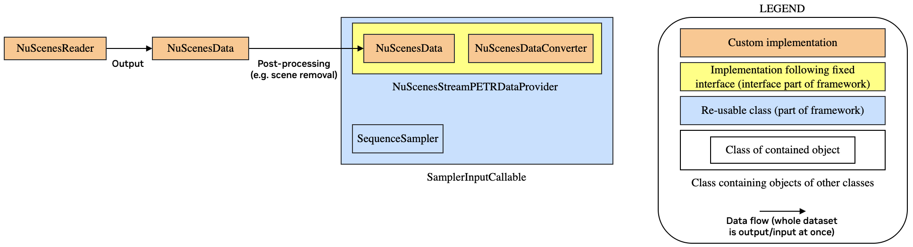

Data Loading for NuScenes
=========================

.. note::
    The classes discussed here are not part of the core functionality of the package, and instead, are
    part of the examples. This is as they are specific to the example use-cases. However, the design & 
    implementation provides a good reference or starting point for implementing custom data loading.
    For some use-cases using NuScenes, it may be possible to re-use it as is (or requiring only some minor 
    changes, e.g. adding additional data such as lidar point clouds).

    The implementation of all of the classes described here can be found in the repository in the 
    ``packages/dali_pipeline_framework/examples/pipeline_setup/additional_impl/data_loading/`` directory.

    Please see the docstrings & comments in the code for more details on the implementation.

Both of the included pipeline examples rely on the NuScenes dataset. However, the data which is used in the 
examples, and how the data needs to be structured, is different. 

In the 2D object detection example, data for single images is used, and e.g. no geometry 
information (projection matrices, ego-poses etc.) or 3D ground truth bounding boxes are needed.
In the StreamPETR example, this additional data is needed, and a single sample contains images from all 6 
cameras from a single snapshot in time during the driving.

.. note::

  This difference also means that the dataset is divided into samples differently. For the 2D object detection 
  example, a single sample is defined by a single image, while for the StreamPETR example, a sample contains
  6 images. This means that each sample of the StreamPETR example contains 6 samples of the 2D object 
  detection example, and the size of the dataset is 6x larger for the latter.

As these use-cases still share a lot of functionality, we design the data loaders as follows:

- ``NuScenesReader``: Reads the original dataset meta-data and converts these into a format which facilitates 
  fast and simple access to the individual samples (as defined in the NuScenes dataset, i.e. containing all 
  data for a single point in time during the driving) and preserves the individual scenes (i.e. driving 
  sequences). While this class does not include all the input data (e.g. lidar points), it is meant to be 
  generic and is not implemented for a specific use case.
- ``NuScenesData``: This is the dataset as obtained by ``NuScenesReader``. Apart from acting as a data 
  container, this class has also helper functions e.g. to split the scenes (sequences) into shorter sequences, 
  to discard some of the scenes (e.g. for splitting into training & validation sets), and to sort the 
  sequences by start time. 

  Also, it provides helpers to convert between flat sample indices (i.e. understanding the whole dataset 
  as a single list of samples) and sequence & in-sequence sample index pairs (i.e. understanding the dataset 
  as a list of driving sequences, each containing multiple samples). 
  
  Furthermore, it provided functionality to 
  store the contained data in the internal file to disk & to read it back. This can be used to avoid 
  re-running ``NuScenesReader`` on every training run, as the conversion into the internal data format may be 
  expensive for large datasets.
- ``NuScenesDataConverter``: Provides helper methods to work with NuScenesData data. Methods include the 
  extraction of annotation data from the samples (including e.g. extraction of bounding boxes in either global 
  or lidar coordinates, obtaining the object velocities etc.) and to convert data to a format which can be 
  used inside the pipeline (e.g. converting pose quaternions to matrices). 
  
  It is also responsible for reading the images given the image locations defined in the meta-data (note that 
  the actual decoding happens as a processing step in the pipeline, not here). Similarly to 
  ``NuScenesReader``, this class is not designed for a specific use-case. Instead, it provides methods which 
  are useful for some of the use-cases.
- ``Nuscenes2DDetectionDataProvider``: This is the ``DataProvider`` specialization for the 2D object detection 
  use-case. It uses an instance of ``NuScenesData`` and functionality from ``NuScenesDataConverter`` to 
  provide samples for the use case of 2D object detection for the individual camera images. In contrast to 
  ``NuScenesDataConverter`` itself, it is intended for a specific use-case and builds up the individual 
  samples for that specific use-case. 
  
  In order to minimize the amount of work for implementing a new use-case, only the use case-specific logic 
  should to be implemented here, and more generic functionality should be implemented in the data reader, 
  dataset, and converter classes (as is done in the classes described above for this use-case), enabling 
  re-use in different use-cases.
- ``NuScenesStreamPETRDataProvider``: Similar to ``Nuscenes2DDetectionDataProvider``, but for the StreamPETR 
  use-case.

   Design of the NuScenes data loader for the StreamPETR use-case. Note that in case of 2D object detection,
   the ``NuScenesReader``, ``NuScenesData`` and ``NuScenesDataConverter`` classes can be re-used, and only the
   data provider needs to be implemented specifically for that use-case.