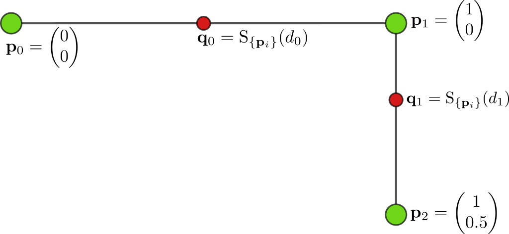

Introduction
============

The ``lane_helpers`` package provides utilities for lane-processing workloads.

Polyline Sampling
-----------------

The main functionality is batched polyline interpolation. A polyline is a sequence of points in the
space :math:`\mathbb{R}^D`, written as :math:`\mathbf{p}_i`, where each pair of consecutive points defines
one line segment.

Given sampling distances :math:`d_j` measured from the first point :math:`\mathbf{p}_0` along the
polyline, the sampling function :func:`~accvlab.lane_helpers.polyline.interpolate` returns the
corresponding sampled points :math:`\mathbf{q}_j`.

   Two-segment polyline sampled at two distances. The input points are shown as green circles, and the
   sampled points are shown as red circles.

Sampling distances do not need to be sorted. Distances can be provided either as absolute distances along
the polyline or as fractions of each polyline's total length.

Point coordinates are not limited to 2D. The coordinate dimension is the last tensor dimension, and 2D,
3D, and higher-dimensional coordinates are supported.

For batches with variable numbers of points or distances, use
:func:`~accvlab.lane_helpers.polyline.interpolate_var_size_batch` with
:class:`~accvlab.batching_helpers.RaggedBatch` inputs.

Functionality to compute the total length of each polyline is also provided (through
:func:`~accvlab.lane_helpers.polyline.lengths` and :func:`~accvlab.lane_helpers.polyline.lengths_var_size_batch`).

Frenet Transformation
---------------------

The :func:`~accvlab.lane_helpers.frenet.transform` function maps two-dimensional Cartesian points to
Frenet coordinates relative to an ordered reference-lane polyline. For every input point, the closest
point on the reference lane is determined and represented by:

* :math:`s`, the longitudinal distance along the reference lane from its first point to the closest point.
* :math:`d`, the signed lateral displacement from the closest point. With the default normals, positive
  values lie to the left of the reference lane's direction and negative values lie to the right.

The reference lane has shape ``(num_reference_points, 2)``, and the points to transform have shape
``(num_points, 2)``. The returned tensor has shape ``(num_points, 2)``, with :math:`s` in the first column
and :math:`d` in the second. The transformation is implemented both for the GPU and the CPU. Inputs can reside on a GPU or
the CPU, but all tensors passed to one call must use the same device and data type.

By default, normals are derived from the reference-lane geometry. At interior lane vertices, normals from
adjacent segments are combined to provide a consistent lateral direction. Applications that need to use other normals
can instead provide either one normal per segment or one normal per vertex.

Per-vertex normals are interpolated along each segment. The two custom-normal modes are mutually exclusive,
and custom normals should be unit length when :math:`d` is intended to represent distance in the input
coordinate system.

The transformation is performed for one reference lane, and operates on 2D coordinates. Reference lanes with fewer than two
points, or with no nonzero-length segments, produce ``NaN`` coordinates.
