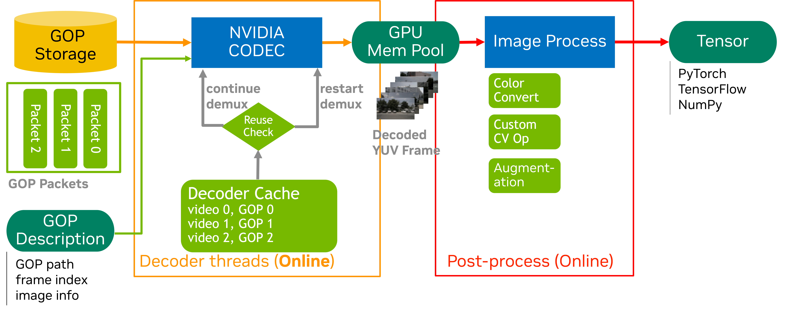

========================================
DataLoader Demuxer-Free Example
========================================

Overview
========

This example demonstrates how to use NVIDIA's accvlab.on_demand_video_decoder library with PyTorch DataLoader for efficient demuxer-free video processing, ideal for training scenarios where datasets are reused frequently and demuxing overhead should be eliminated.

The specific code implementation can be found in ``packages/on_demand_video_decoder/examples/demuxer_free_decode`` and ``packages/on_demand_video_decoder/examples/demuxer_free_decode_cache``.

The "demuxer-free" approach refers to pre-extracting and storing GOP (Group of Pictures) packets offline, enabling:

- **Zero Demuxing Overhead**: All demuxing work is performed once during preprocessing; runtime only loads and decodes GOP packets
- **Maximum Throughput**: Eliminates CPU demuxing bottleneck for higher decode performance
- **Reusable Dataset**: GOP packets are stored persistently and can be reused across multiple training runs
- **Fast Random Access**: Pre-computed GOP indices enable instant frame-to-GOP lookup

The workflow consists of two phases:

1. **Preprocessing Phase (Offline)**: Extract and store GOP packets from all videos
2. **Training Phase (online)**: Load pre-stored GOP packets and decode them directly on GPU

Key Features
============

- **Demuxer-Free Pipeline**: Eliminates runtime demuxing by pre-storing GOP packets in binary format
- **Persistent GOP Index**: Uses ``.gop_index.json`` files for instant frame-to-GOP mapping without directory scans
- **Fixed GOP Optimization**: Optional ``--fix_gop_size`` enables fast-path computation for constant GOP size datasets
- **Custom PyTorch Dataset**: Implements lazy initialization of GOP storage manager for memory-efficient loading
- **Custom Sampler**: Organizes video clips into batches for efficient processing with distributed training support
- **Multi-camera Support**: Handles synchronized frames from multiple cameras with pre-cached GOP packets
- **Distributed Training**: Compatible with PyTorch's distributed training framework
- **Performance Profiling**: Includes NVTX markers for performance analysis
- **Storage Flexibility**: Supports both local and network storage for GOP packet files

Index Data Format
=================

.. note::

   The JSON file and the selection of frames to access are used here for demonstration purposes. In a
   real-world scenario, the file names and indices would be obtained from the dataset metadata.

The example expects a JSON file with the following structure:

.. code-block:: text

   {
       "video_dir1": {
           "clip0id": frame_count,
           "clip1id": frame_count,
           ...
       },
       "video_dir2": {
           "clip0id": frame_count,
           "clip1id": frame_count,
           ...
       }
   }

Each video directory should contain subdirectories for each clip, and each clip directory should contain MP4 files for different cameras.

GOP Storage Layout
==================

Assuming ``video_base_path`` contains the original videos and ``gop_base_path`` is where GOP binaries are stored:

.. code-block:: text

   video_base_path/
   ├── clip0/
   │   ├── cam0.mp4
   │   └── cam1.mp4
   └── clip1/
       ├── cam0.mp4
       └── cam1.mp4

   gop_base_path/
   ├── clip0/
   │   ├── cam0.mp4/
   │   │   ├── .gop_index.json
   │   │   ├── gop.0.30.bin
   │   │   ├── gop.30.27.bin
   │   │   └── gop.57.30.bin
   │   └── cam1.mp4/
   │       ├── .gop_index.json
   │       ├── gop.0.30.bin
   │       ├── gop.30.27.bin
   │       └── gop.57.30.bin
   └── clip1/
       ├── cam0.mp4/
       │   ├── .gop_index.json
       │   ├── gop.0.30.bin
       │   ├── gop.30.30.bin
       │   └── gop.60.18.bin
       └── cam1.mp4/
           ├── .gop_index.json
           ├── gop.0.30.bin
           ├── gop.30.30.bin
           └── gop.60.18.bin

Data Loading Structure
======================

- For Random Access Pattern, ref to ``packages/on_demand_video_decoder/docs/example/dataloader_random_decode.md``.
- For Stream Access Pattern, ref to ``packages/on_demand_video_decoder/docs/example/dataloader_stream_decode.md``.

Key differences from online demuxing:

- **Preprocessing**: GOP packets are extracted once and stored as ``.bin`` files
- **Runtime**: Only file I/O and GPU decoding, no demuxing overhead
- **Random Access (Optional)**: Frame-to-GOP mapping is pre-computed in ``.gop_index.json``.

Usage
=====

Step 1: Precompute and Store GOP Packets
^^^^^^^^^^^^^^^^^^^^^^^^^^^^^^^^^^^^^^^^^

Before training, you need to extract and store GOP packets from your video dataset.

Edit the configuration paths in ``examples/demuxer_free_decode/main_store_gops.py``:

- ``VIDEO_BASE_PATH``: Directory containing your original video files
- ``GOP_BASE_PATH``: Directory where GOP packets will be stored

Then run the preprocessing script:

.. code-block:: bash

   python examples/demuxer_free_decode/main_store_gops.py

**Preprocessing Function Implementation:**

.. note-literalinclude:: ../../examples/demuxer_free_decode/main_store_gops.py
   :language: python
   :caption: examples/demuxer_free_decode/main_store_gops.py
   :linenos:
   :lineno-match:
   :start-at: # .. doc-marker-begin: preprocessing-main
   :end-before: # .. doc-marker-end: preprocessing-main

This preprocessing step will:

1. Recursively scan ``VIDEO_BASE_PATH`` for all ``.mp4`` files
2. Extract GOP packets from each video
3. Store packets as ``gop.{start_frame}.{frame_count}.bin`` files under ``GOP_BASE_PATH``
4. Generate ``.gop_index.json`` for each video to enable fast frame-to-GOP lookup

.. note::

   This is a one-time operation per dataset. The stored GOP packets can be reused across multiple training 
   runs.

Step 2: Training with Demuxer-Free Pipeline
^^^^^^^^^^^^^^^^^^^^^^^^^^^^^^^^^^^^^^^^^^^^

Basic Usage
-----------

.. code-block:: bash

   python examples/demuxer_free_decode/main.py \
     --index_file examples/index_frame.json \
     --group_num 4 \
     --num_workers 2 \
     --video_base_path /data/nuscenes-mini/1600x900_gop30/ \
     --gop_base_path /data/nuscenes-mini/1600x900_gop30_packets/

Fixed GOP Size Optimization
----------------------------

If your dataset has a constant GOP size, enable the fast-path optimization:

.. code-block:: bash

   python examples/demuxer_free_decode/main.py \
     --index_file examples/index_frame.json \
     --group_num 4 \
     --num_workers 2 \
     --video_base_path /data/nuscenes-mini/1600x900_gop30/ \
     --gop_base_path /data/nuscenes-mini/1600x900_gop30_packets/ \
     --fix_gop_size 30

This skips GOP index file scanning and computes filenames directly for maximum performance.

Distributed Training
--------------------

.. code-block:: bash

   python -m torch.distributed.run --nproc_per_node=2 \
     examples/demuxer_free_decode/main.py \
     --index_file examples/index_frame.json \
     --group_num 4 \
     --num_workers 2 \
     --video_base_path /data/nuscenes-mini/1600x900_gop30/ \
     --gop_base_path /data/nuscenes-mini/1600x900_gop30_packets/

Command Line Arguments
^^^^^^^^^^^^^^^^^^^^^^

- ``--index_file``: Path to the JSON file containing frame index information (default: ``examples/index_frame.json``)
- ``--group_num``: Number of clips to process in each batch (default: 4)
- ``--num_workers``: Number of worker processes for data loading (default: 2)
- ``--video_base_path``: Base directory of the original videos (used to derive relative GOP storage paths)
- ``--gop_base_path``: Base directory containing stored GOP packet files
- ``--use_persistent_index``: Use ``.gop_index.json`` files for faster lookup (default: True)
- ``--fix_gop_size``: Fixed GOP size for fast-path optimization (e.g., 30). If > 0, computes filenames directly without scanning

Architecture
============

GOPStorageManager
^^^^^^^^^^^^^^^^^

The ``GOPStorageManager`` class handles all GOP packet storage and retrieval operations.

**Initialization:**

.. note-literalinclude:: ../../examples/demuxer_free_decode/gop_storage.py
   :language: python
   :caption: examples/demuxer_free_decode/gop_storage.py
   :linenos:
   :lineno-match:
   :start-at: # .. doc-marker-begin: gop-storage-init
   :end-before: # .. doc-marker-end: gop-storage-init

**store_gops() - Preprocessing Method:**

Extracts GOP packets from all ``.mp4`` files under ``video_base_path``, saves each GOP as ``gop.{start_frame}.{frame_count}.bin``, and generates ``.gop_index.json`` for fast frame-to-GOP mapping.

.. note-literalinclude:: ../../examples/demuxer_free_decode/gop_storage.py
   :language: python
   :caption: examples/demuxer_free_decode/gop_storage.py
   :linenos:
   :lineno-match:
   :start-at: # .. doc-marker-begin: gop-storage-store
   :end-before: # .. doc-marker-end: gop-storage-store

**load_gops() - Runtime Method:**

Loads required GOP packets by consulting the persistent index, returns merged GOP data via ``LoadGops`` for GPU decoding, and supports variable GOP sizes within a video.

.. note-literalinclude:: ../../examples/demuxer_free_decode/gop_storage.py
   :language: python
   :caption: examples/demuxer_free_decode/gop_storage.py
   :linenos:
   :lineno-match:
   :start-at: # .. doc-marker-begin: gop-storage-load
   :end-before: # .. doc-marker-end: gop-storage-load

**load_gops_fast() - Optimized Runtime Method:**

Computes GOP filenames directly using ``--fix_gop_size``, skips index file reading for maximum performance, and requires constant GOP size across the dataset.

.. note-literalinclude:: ../../examples/demuxer_free_decode/gop_storage.py
   :language: python
   :caption: examples/demuxer_free_decode/gop_storage.py
   :linenos:
   :lineno-match:
   :start-at: # .. doc-marker-begin: gop-storage-load-fast
   :end-before: # .. doc-marker-end: gop-storage-load-fast

VideoClipDatasetDecodeOnly
^^^^^^^^^^^^^^^^^^^^^^^^^^^

The ``VideoClipDatasetDecodeOnly`` class extends PyTorch's ``Dataset`` and provides:

- Lazy initialization of ``GOPStorageManager`` for memory efficiency
- Returns ``PacketOndemandBuffers`` containing pre-loaded GOP packets for each batch item
- Multi-camera frame synchronization with pre-cached GOP packets
- Error handling and validation
- Compatible with decoders from ``video_transforms.py``

**Implementation:**

.. note-literalinclude:: ../../examples/demuxer_free_decode/main.py
   :language: python
   :caption: examples/demuxer_free_decode/main.py
   :linenos:
   :lineno-match:
   :start-at: # .. doc-marker-begin: dataset-decode-only
   :end-before: # .. doc-marker-end: dataset-decode-only

VideoClipSampler
^^^^^^^^^^^^^^^^

The ``VideoClipSampler`` class extends PyTorch's ``Sampler`` and provides:

- Organizes ``group_num`` clips into each batch for efficient processing
- Distributed training support with proper rank/world_size sharding
- Optional shuffling support for each epoch
- Ensures balanced workload distribution across GPU ranks

Example Training Loop
^^^^^^^^^^^^^^^^^^^^^

The following code shows the complete setup for training with the demuxer-free pipeline:

.. note-literalinclude:: ../../examples/demuxer_free_decode/main.py
   :language: python
   :caption: examples/demuxer_free_decode/main.py
   :linenos:
   :lineno-match:
   :start-at: # .. doc-marker-begin: training-setup
   :end-before: # .. doc-marker-end: training-setup

Performance
===========

Test Environment
^^^^^^^^^^^^^^^^

- **GPU**: NVIDIA A100-SXM4-80GB
- **CPU**: AMD EPYC 7J13 64-Core Processor
- **Storage**: NFS
- **DataSet**: NuScenes-mini, 10 clips, 6 cameras, H.265, 1600x900, GOP_SIZE=30, non-bframe

Performance Metrics (frames/sec)
^^^^^^^^^^^^^^^^^^^^^^^^^^^^^^^^^

Using the Demuxer-Free Access API, measure the throughput (frames per second) between stream frame access and random frame access:

===============  ===============  ==================
configuration    stream access    random access
===============  ===============  ==================
1 GPU            803.09           306.29
2 GPU            1584.18          615.5
4 GPU            2847.4           1195.65
8 GPU            3859.31          2326.49
===============  ===============  ==================

Optimization Tips
^^^^^^^^^^^^^^^^^

- **CPU Efficiency**: Demuxing overhead is completely eliminated; workers only perform filesystem I/O and GOP packet loading
- **GPU Memory**: Only the main process requires GPU resources for decoding; adjust ``group_num`` based on available GPU memory
- **Persistent Index**: Keep ``--use_persistent_index`` enabled for large datasets to avoid directory scans at runtime
- **Fixed GOP Fast Path**: Use ``--fix_gop_size`` when your dataset has constant GOP size for maximum throughput
- **Storage Location**: Place ``gop_base_path`` on fast local/NVMe storage for optimal I/O performance
- **Worker Processes**: Adjust ``num_workers`` based on storage bandwidth and CPU cores
- **GOP Size**: Smaller GOP sizes improve random access performance but increase storage overhead

.. note::
   While this example demonstrates the basic usage of the demuxer-free approach, this is not the maximum 
   performance which can be achieved with this approach. We can still do more optimization such as introducing
   a GOP cache mechanism & passing only newly accessed GOPs from the data loader processes to the main process 
   to achieve better performance.

Performance Profiling
^^^^^^^^^^^^^^^^^^^^^^

Use NVIDIA Nsight Systems for detailed performance analysis:

.. code-block:: bash

   nsys profile --trace-fork-before-exec true -w true -f true -t cuda,nvtx,osrt,cudnn,cublas,nvvideo --gpu-video-device all -x true -o dataloader_decode_only python examples/demuxer_free_decode/main.py --index_file examples/index_frame.json

