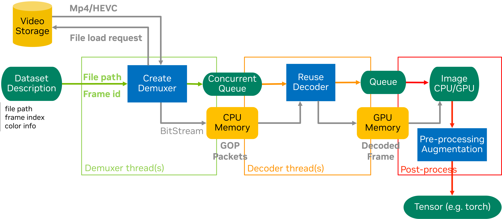

====================================
DataLoader Random Decode Example
====================================

Overview
========

This example demonstrates how to use NVIDIA's accvlab.on_demand_video_decoder library with PyTorch DataLoader for efficient random frame extraction from random videos in batch form, ideal for training scenarios that require diverse sampling patterns.

The specific code implementation can be found in ``packages/on_demand_video_decoder/examples/dataloader_random_decode``.

Key Features
============

- **Custom PyTorch Dataset**: Implements lazy initialization of the GOP decoder to support multiple processes
- **Custom Sampler**: Organizes random video clips into batches for efficient processing with distributed training support
- **Multi-camera Support**: Handles synchronized frames from multiple cameras with random access
- **Distributed Training**: Compatible with PyTorch's distributed training framework
- **Performance Profiling**: Includes NVTX markers for performance analysis
- **Error Handling**: Comprehensive error handling and validation
- **Random Access Decoding**: GOP-based random frame extraction optimized for training diversity

Index Data Format
=================

.. note::

   The JSON file and the selection of frames to access are used here for demonstration purposes. In a
   real-world scenario, the file names and indices would be obtained from the dataset metadata.

The example expects a JSON file with the following structure:

.. code-block:: text

   {
       "video_dir1": {
           "clip0id": frame_count,
           "clip1id": frame_count,
           ...
       },
       "video_dir2": {
           "clip0id": frame_count,
           "clip1id": frame_count,
           ...
       }
   }

Each video directory should contain subdirectories for each clip, and each clip directory should contain MP4 files for different cameras.

Data Loading Structure
======================

The data loading process follows a hierarchical structure optimized for **random access and maximum diversity**:

.. code-block:: text

   Random Sampling Dimension
   ┌─────────────────────────────────────────────────────────────────────────────┐
   │                         RANDOM DECODING PIPELINE                            │
   │                    (GOP-based Random Frame Access)                          │
   └─────────────────────────────────────────────────────────────────────────────┘

   Batch Dimension (group_num clips per batch, fixed) - Random Sampling
   ├── Batch 0 (e.g., 4 clips)
   │   ├─→ Random Clip A (from video_dir3/clip7)
   │   │   └─→ Random Frame 8  → [cam0_f8,  cam1_f8,  cam2_f8,  cam3_f8,  cam4_f8,  cam5_f8 ]
   │   │
   │   ├─→ Random Clip B (from video_dir1/clip2)
   │   │   └─→ Random Frame 5  → [cam0_f5,  cam1_f5,  cam2_f5,  cam3_f5,  cam4_f5,  cam5_f5 ]
   │   │
   │   ├─→ Random Clip C (from video_dir7/clip4)
   │   │   └─→ Random Frame 12 → [cam0_f12, cam1_f12, cam2_f12, cam3_f12, cam4_f12, cam5_f12]
   │   │
   │   └─→ Random Clip D (from video_dir2/clip9)
   │       └─→ Random Frame 61 → [cam0_f61, cam1_f61, cam2_f61, cam3_f61, cam4_f61, cam5_f61]
   │
   ├── Batch 1 (e.g., 4 clips)
   │   ├─→ Random Clip E (from video_dir5/clip1)
   │   │   └─→ Random Frame 47 → [cam0_f47, cam1_f47, cam2_f47, cam3_f47, cam4_f47, cam5_f47]
   │   │
   │   ├─→ Random Clip F (from video_dir4/clip6)
   │   │   └─→ Random Frame 55 → [cam0_f55, cam1_f55, cam2_f55, cam3_f55, cam4_f55, cam5_f55]
   │   │
   │   ├─→ Random Clip G (from video_dir8/clip3)
   │   │   └─→ Random Frame 31 → [cam0_f31, cam1_f31, cam2_f31, cam3_f31, cam4_f31, cam5_f31]
   │   │
   │   └─→ Random Clip H (from video_dir6/clip5)
   │       └─→ Random Frame 3  → [cam0_f3,  cam1_f3,  cam2_f3,  cam3_f3,  cam4_f3,  cam5_f3 ]
   │
   └── ... (continues with random sampling)

   Data Flow with Random Access:
   Random Selection → Batch → Random Clip → Random Frame_ID → Synchronized Multi-camera frames
          ↓             ↓          ↓              ↓                        ↓
     Shuffled      group_num   Different     Non-sequential    [cam0, cam1, cam2, ...] (fixed num)
      clips      (fixed size)  video dirs      frame IDs        all at same frame_id

**Random Access Dimension Details:**

- **Random Selection**: Clips are randomly sampled from the entire dataset (no temporal ordering)
- **Batch**: Contains ``group_num`` randomly selected clips (batch size is **fixed**)
- **Random Clip**: Each clip is independently sampled from potentially different video directories
- **Random Frame_ID**: Frame indices within each clip are accessed randomly (non-sequential across calls)
- **Multi-camera**: **Fixed number** of synchronized cameras, all accessing the **same frame index** simultaneously

  - Example: If frame_id=15 is requested, all cameras (cam0, cam1, cam2, ..., cam5) decode frame 15
  - Camera count remains constant across all clips and batches

**Random Access Benefits:**

- **Training Diversity**: Maximizes data variety by sampling from different videos and frames
- **Better Generalization**: Prevents temporal bias by breaking sequential patterns
- **Efficient GOP Decoding**: Leverages GOP structure for fast random frame access
- **Flexible Sampling**: Supports various sampling strategies (uniform, weighted, etc.)
- **Reduced Overfitting**: Random access patterns improve model robustness

Usage
=====

Basic Usage
^^^^^^^^^^^

.. code-block:: bash

   python main.py --index_file /path/to/index_frame.json --group_num 4 --num_workers 2

Distributed Training
^^^^^^^^^^^^^^^^^^^^

.. code-block:: bash

   python -m torch.distributed.run --nproc_per_node=2 main.py --index_file /path/to/index_frame.json --group_num 4 --num_workers 2

Command Line Arguments
^^^^^^^^^^^^^^^^^^^^^^

- ``--index_file``: Path to the JSON file containing frame index information (default: ``example/index_frame.json``)
- ``--group_num``: Number of clips to process in each batch (default: 4)
- ``--num_workers``: Number of worker processes for data loading (default: 2)

Architecture
============

VideoClipDataset
^^^^^^^^^^^^^^^^

The ``VideoClipDataset`` class extends PyTorch's ``Dataset`` and provides:

- Lazy initialization of the NVIDIA GOP decoder
- GPU-accelerated random frame decoding
- Multi-camera frame synchronization with random access
- Error handling and validation
- **Random Decoder Configuration** (``nvc.CreateGopDecoder``):

  - ``maxfiles``: Maximum number of video files to keep open simultaneously
  - ``iGpu``: GPU device ID for decoding

**Implementation:**

.. note-literalinclude:: ../../examples/dataloader_random_decode/main.py
   :language: python
   :caption: examples/dataloader_random_decode/main.py
   :linenos:
   :lineno-match:
   :start-at: # .. doc-marker-begin: dataset-random
   :end-before: # .. doc-marker-end: dataset-random

VideoClipSampler
^^^^^^^^^^^^^^^^

The ``VideoClipSampler`` class extends PyTorch's ``Sampler`` and provides:

- Random clip selection across the entire dataset
- Efficient batch organization with diversity
- Distributed training support with proper sharding
- Shuffling support for each epoch

Example Training Loop
^^^^^^^^^^^^^^^^^^^^^

The following code shows the complete setup for training with random frame access:

.. note-literalinclude:: ../../examples/dataloader_random_decode/main.py
   :language: python
   :caption: examples/dataloader_random_decode/main.py
   :linenos:
   :lineno-match:
   :start-at: # .. doc-marker-begin: training-setup-random
   :end-before: # .. doc-marker-end: training-setup-random

Performance
===========

Test Environment
^^^^^^^^^^^^^^^^

- **GPU**: NVIDIA A100-SXM4-80GB
- **CPU**: AMD EPYC 7J13 64-Core Processor
- **Storage**: NFS
- **DataSet**: NuScenes-mini, 10 clips, 6 cameras, H.265, 1600x900, GOP_SIZE=30, non-bframe

Performance Metrics (frames/sec)
^^^^^^^^^^^^^^^^^^^^^^^^^^^^^^^^^

Using the Random Access API, measure the throughput (frames per second) when accessing random frames and streaming frames.

===============  ===============  ===============
configuration    random frames    stream frames
===============  ===============  ===============
1 GPU            381.1            389.89
2 GPU            754.34           772.42
4 GPU            1518.15          1544.81
8 GPU            3065.5           3094.21
===============  ===============  ===============

Performance Optimization Tips
^^^^^^^^^^^^^^^^^^^^^^^^^^^^^

- **Spawn Mode**: PyTorch must be set to spawn mode when using GPU (NvCodec) within the DataLoader
- **GPU Memory**: Each worker maintains its own CUDA context, which can lead to increased GPU memory usage
- **Batch Size**: Adjust ``group_num`` based on available GPU memory
- **Worker Processes**: Adjust ``num_workers`` based on CPU cores and I/O requirements
- **Random Access Overhead**: Random frame access may be slower than sequential access due to GOP seeking
- **GOP Size Impact**: Smaller and fixed GOP sizes enable finer random access but may reduce compression efficiency
- **File Handle Management**: The ``maxfiles`` parameter controls how many video files stay open; tune based on dataset size
- **Cache Locality**: Random access patterns may have lower cache hit rates compared to sequential access

Performance Profiling
^^^^^^^^^^^^^^^^^^^^^^

Use NVIDIA Nsight Systems for detailed performance analysis:

.. code-block:: bash

   nsys profile --trace-fork-before-exec true -w true -f true -t cuda,nvtx,osrt,cudnn,cublas,nvvideo --gpu-video-device all -x true -o dataloader_random_decode python main.py --index_file /path/to/index_frame.json

